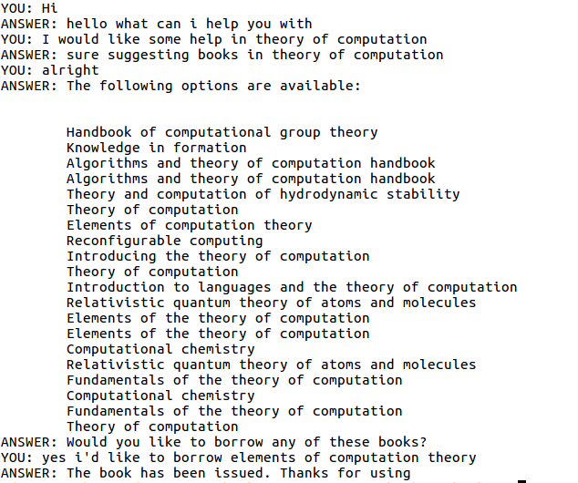

Task-Based Conversational Agent Using Seq2Seq and Retrieval
=====

Implementation
---

[Slides for the same](https://drive.google.com/file/d/1CDX7I-xrA5S5Ws_1h3bC5IHsXL4g9IJ3/view)

A chatbot based on recurrent neural networks (RNN). Encoder-decoder long short-term memory (LSTM) model has been used. The Encoder-Decoder LSTM is a recurrent neural network designed to address sequence-to-sequence problems. The chatbot has been built with Keras (TensorFlow backened).

This work is advised by [Prof. Ashwin Srinivasan, BITS Pilani. K. K. Birla Goa Campus.](http://universe.bits-pilani.ac.in/goa/ashwin/profile) 

Execution
----
1. Run the file preprocessing.py to preprocess the training data. This will also create three pickle files for training, testing and both. 
2. Run train.py to train the model. This will also save the model in a .hdf5 format. 
3. Run test.py for an instance of the chatbot. 

Dependencies include:
----
1. `numpy`
2. `keras`
3. `tensorflow` 

Dataset generation
----
There is no publicly available dataset for the task of a library-based
conversational agent or for the case of book recomenndation systems either.
Hence the dataset is generated from a template of variations of natural language
which can be used when a student interacts with such a conversational agent.

Weights based on a random-normal distribution are applied to the options for a
particular conversation to make sure that the dataset isnt balanced.

For example for greetings, the weights are divided between “Hello, how is it
going”, “Good day. How can I assist you”, “Hi, what do you need help with”, etc.
Similar process is followed for the user’s responses to the bot, such as variations
of “May I have a book in networks”, “I am looking for some help in Machine
Learning”, “Can you suggest something in Computer Architecture”, etc to model
it as close to natural language as possible and cover all possibilities of how a
user may interact with a bot.

The bot is currently trained on 14 topics from the ACM CS subjects which it is
able to correctly predict.

An example iteration of the chatbot. 

